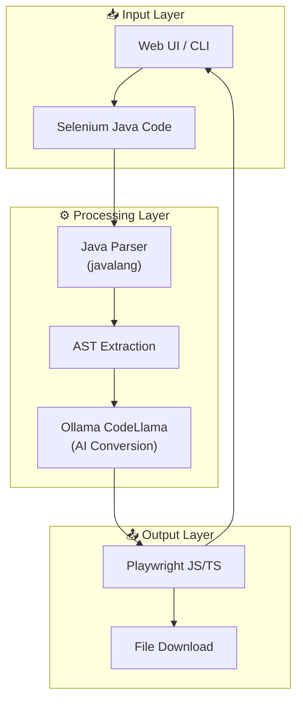
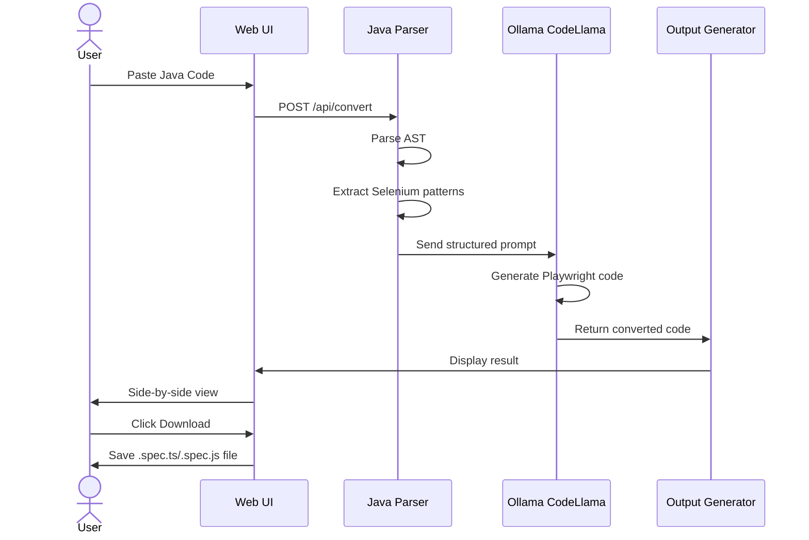
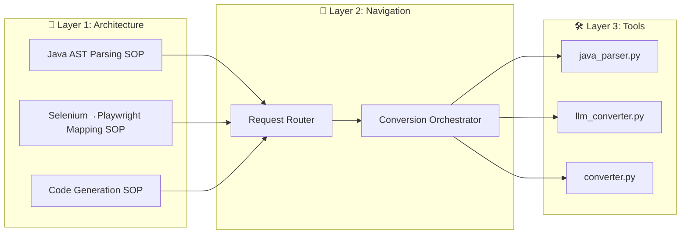

# Selenium Java to Playwright Converter

> 🚀 Convert your Selenium Java + TestNG test scripts to Playwright TypeScript/JavaScript with the power of AI (Ollama CodeLlama).

[](https://python.org)
[](https://flask.palletsprojects.com)
[](LICENSE)

---

## 📋 Table of Contents

- [Features](#features)
- [Architecture](#architecture)
- [Installation](#installation)
- [Usage](#usage)
- [API Reference](#api-reference)
- [Supported Conversions](#supported-conversions)
- [Screenshots](#screenshots)

---

## ✨ Features

- 🔄 **AI-Powered Conversion**: Uses Ollama CodeLlama for intelligent code transformation
- 🌐 **Web UI**: Beautiful two-pane editor for side-by-side comparison
- 💻 **CLI Support**: Batch convert entire directories
- 📝 **Dual Output**: TypeScript and JavaScript support
- 🔍 **Java AST Parsing**: Extracts Selenium patterns using `javalang`
- 📦 **Download**: Save converted files directly from the browser

---

## 🏗️ Architecture

### System Architecture



### Data Flow



### 3-Layer Architecture (B.L.A.S.T. Protocol)



---

## 📦 Installation

### Prerequisites

- Python 3.10+
- [Ollama](https://ollama.com) installed locally
- CodeLlama model pulled

### Step 1: Install Ollama & CodeLlama

```bash
# Install Ollama from https://ollama.com

# Pull CodeLlama model
ollama pull codellama

# Verify installation
ollama list
```

### Step 2: Clone Repository

```bash
git clone https://github.com/aman2743/VSSeleniumJava2PlaywrightTS.git
cd VSSeleniumJava2PlaywrightTS
```

### Step 3: Install Dependencies

```bash
pip install flask javalang ollama
```

---

## 🚀 Usage

### Option 1: Web UI (Recommended)

```bash
python app.py
```

Open your browser: **http://localhost:5000**

**Features:**
- Paste Java code in the left pane
- Click **"Convert Code"**
- View Playwright output in the right pane
- Select TypeScript or JavaScript
- Download the converted file

### Option 2: CLI

```bash
# Convert a single file
python tools/converter.py path/to/LoginTest.java -l typescript

# Convert entire directory
python tools/converter.py path/to/test/suite/ -l javascript

# Options:
#   -l, --language    typescript or javascript (default: typescript)
#   -o, --output      output directory (default: output)
```

### Option 3: Python API

```python
from tools.converter import SeleniumToPlaywrightConverter

converter = SeleniumToPlaywrightConverter('typescript', 'output')

# Convert from string
java_code = """
import org.testng.annotations.Test;
public class Test {
    @Test
    public void testLogin() {
        driver.findElement(By.id("username")).sendKeys("admin");
    }
}
"""

result = converter.convert(java_code, "LoginTest.java")
print(result['converted_code'])
print(f"Saved to: {result['output_file']}")
```

---

## 🔌 API Reference

### POST /api/convert

Convert Selenium Java code to Playwright.

**Request:**
```json
{
  "code": "import org.testng...",
  "language": "typescript"
}
```

**Response:**
```json
{
  "success": true,
  "converted_code": "import { test, expect }...",
  "output_file": "output/login-test.spec.ts",
  "metadata": { ... }
}
```

### GET /api/health

Check service health.

**Response:**
```json
{
  "status": "ok",
  "ollama": true
}
```

---

## 🔄 Supported Conversions

### Locators
| Selenium (Java) | Playwright (JS/TS) |
|-----------------|-------------------|
| `By.id("x")` | `page.locator('#x')` |
| `By.className("x")` | `page.locator('.x')` |
| `By.cssSelector("x")` | `page.locator('x')` |
| `By.xpath("x")` | `page.locator('xpath=x')` |
| `By.name("x")` | `page.locator('[name="x"]')` |

### Actions
| Selenium (Java) | Playwright (JS/TS) |
|-----------------|-------------------|
| `sendKeys("text")` | `fill('text')` |
| `click()` | `click()` |
| `getText()` | `textContent()` |
| `getAttribute("x")` | `getAttribute('x')` |

### Navigation
| Selenium (Java) | Playwright (JS/TS) |
|-----------------|-------------------|
| `driver.get("url")` | `page.goto('url')` |
| `driver.navigate().back()` | `page.goBack()` |
| `Thread.sleep(ms)` | `page.waitForTimeout(ms)` |

### TestNG → Playwright Test
| TestNG | Playwright |
|--------|-----------|
| `@Test` | `test('name', async () => {})` |
| `@BeforeMethod` | `test.beforeEach()` |
| `@AfterMethod` | `test.afterEach()` |
| `Assert.assertEquals(a,b)` | `expect(a).toBe(b)` |

---

## 📸 Screenshots

### Web UI

```
┌─────────────────────────────────────────────────────────────────┐
│           Selenium Java to Playwright Converter                 │
├─────────────────────────────────────────────────────────────────┤
│  [TypeScript ▼]  [Convert Code]  [Download File]               │
├──────────────────────────┬──────────────────────────────────────┤
│  Source (Selenium Java)  │  Result (Playwright TS)              │
│  ┌────────────────────┐  │  ┌────────────────────────────────┐  │
│  │import org.openq... │  │  │import { test, expect } from... │  │
│  │                    │  │  │                                │  │
│  │@Test               │  │  │test('login', async ({page}) =>│  │
│  │public void test() {│  │  │{                               │  │
│  │  driver.find...    │  │  │  await page.locator('#user')...│  │
│  │}                   │  │  │});                             │  │
│  └────────────────────┘  │  └────────────────────────────────┘  │
│  15 lines                │  12 lines                              │
└──────────────────────────┴──────────────────────────────────────┘
```

---

## 🏗️ Project Structure

```
VSSeleniumJava2PlaywrightTS/
├── 📐 architecture/          # Layer 1: SOPs
│   ├── 01_java_ast_parsing_sop.md
│   ├── 02_selenium_to_playwright_mapping_sop.md
│   └── 03_code_generation_sop.md
│
├── 🛠️ tools/                 # Layer 3: Tools
│   ├── converter.py          # Main orchestrator
│   ├── java_parser.py        # Java AST parser
│   ├── llm_converter.py      # Ollama integration
│   └── test_dependencies.py  # Health checks
│
├── 🌐 templates/             # Web UI
│   └── index.html            # Two-pane editor
│
├── 📋 Project Files
│   ├── app.py                # Flask application
│   ├── B.L.AS.T.md           # Protocol documentation
│   ├── task_plan.md          # Project roadmap
│   ├── findings.md           # Research log
│   ├── progress.md           # Session history
│   └── gemini.md             # Project constitution
│
├── 📁 .tmp/                  # Temporary files
├── 📁 output/                # Converted files
└── 📄 README.md              # This file
```

---

## 🔧 Development

### Running Tests

```bash
# Test dependencies
python tools/test_dependencies.py

# Test conversion
python tools/converter.py .tmp/SimpleTest.java -l typescript
```

### Adding New Mappings

Edit `architecture/02_selenium_to_playwright_mapping_sop.md` to add new API mappings, then update `tools/llm_converter.py` system prompt.

---

## 📜 License

MIT License - see LICENSE file for details.

---

## 🙏 Acknowledgments

- [javalang](https://github.com/c2nes/javalang) - Pure Python Java parser
- [Ollama](https://ollama.com) - Local LLM runner
- [CodeLlama](https://github.com/meta-llama/codellama) - Code generation model
- [Playwright](https://playwright.dev) - Modern web testing framework

---

## 📧 Support

For issues and feature requests, please use the [GitHub Issues](https://github.com/aman2743/VSSeleniumJava2PlaywrightTS/issues) page.

---

**Built with ❤️ using the B.L.A.S.T. Protocol**
